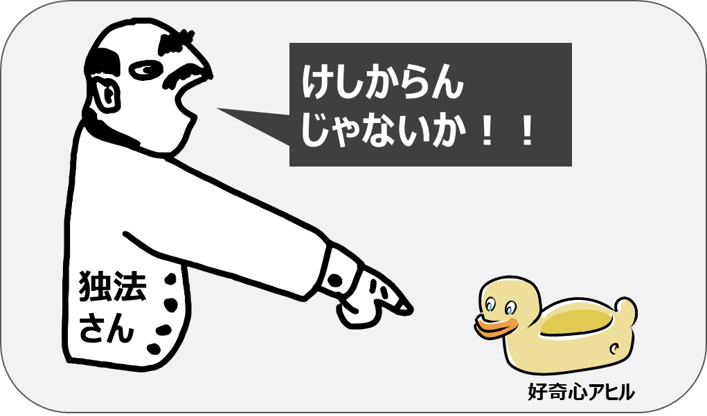

みなさーん、k8sやってますかー？

僕は当然やっています。

さて今回はwireguardを使っておうちにあるサーバをドイツのマスターノードに参加させてみようと思います。



## 構成
- Contabo (ドイツ、マスターノード)
- ラズパイ　(日本、ワーカーノード)
- 普通のVM (日本、ワーカーノード)

OSは基本的にdebian使います。

## まずWireguardをインストール

```
apt-get install wireguard-tools
```